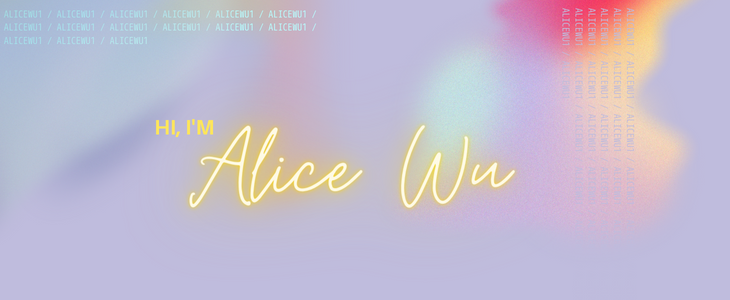

## **Hey there!**

- 🎓 Currently: M.S. Applied Health Informatics Student at Stony Brook University
- 🌱 I’m currently learning: Python, R, SQL, AWS, Azure, GCP
- ⭐I'm passionate about: coding, data analytics, and data science
- 📫 How to reach me: LinkedIn

 

## 📌 Currently Working on:

 

## 📈 GitHub Stats

 

### 💼 Skills 
-----

<!--
**alicewu1/alicewu1** is a ✨ _special_ ✨ repository because its `README.md` (this file) appears on your GitHub profile.

Here are some ideas to get you started:
- Currently: M.S. Applied Health Informatics Student at Stony Brook University
- 🔭 I’m currently working on ...
- 🌱 I’m currently learning ...
- 👯 I’m looking to collaborate on ...
- 🤔 I’m looking for help with ...
- 💬 Ask me about ...
- 📫 How to reach me: ...
- 😄 Pronouns: ...
- ⚡ Fun fact: ...
-->
